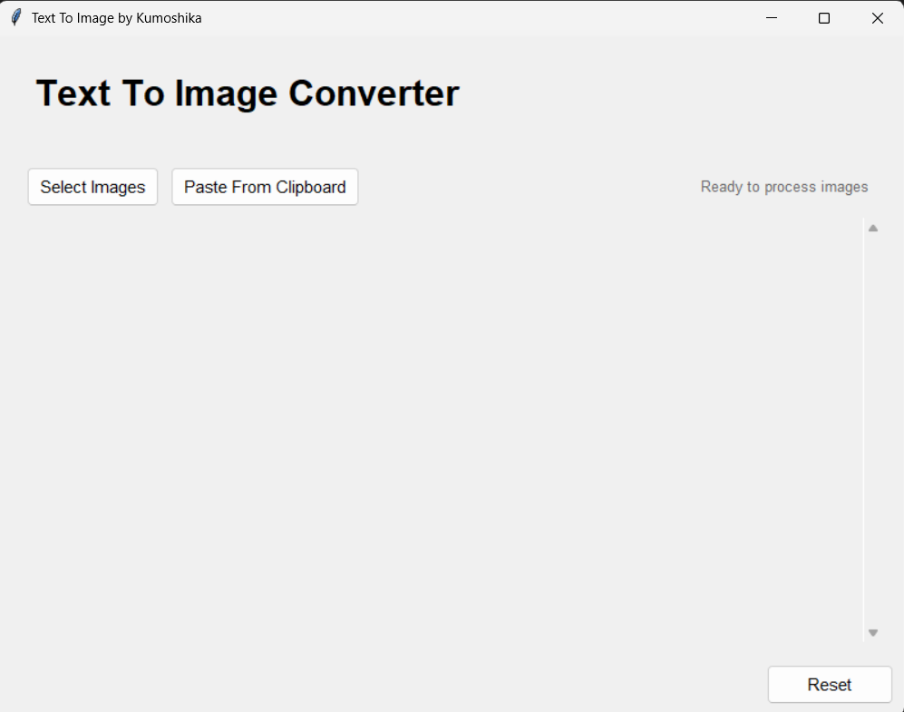
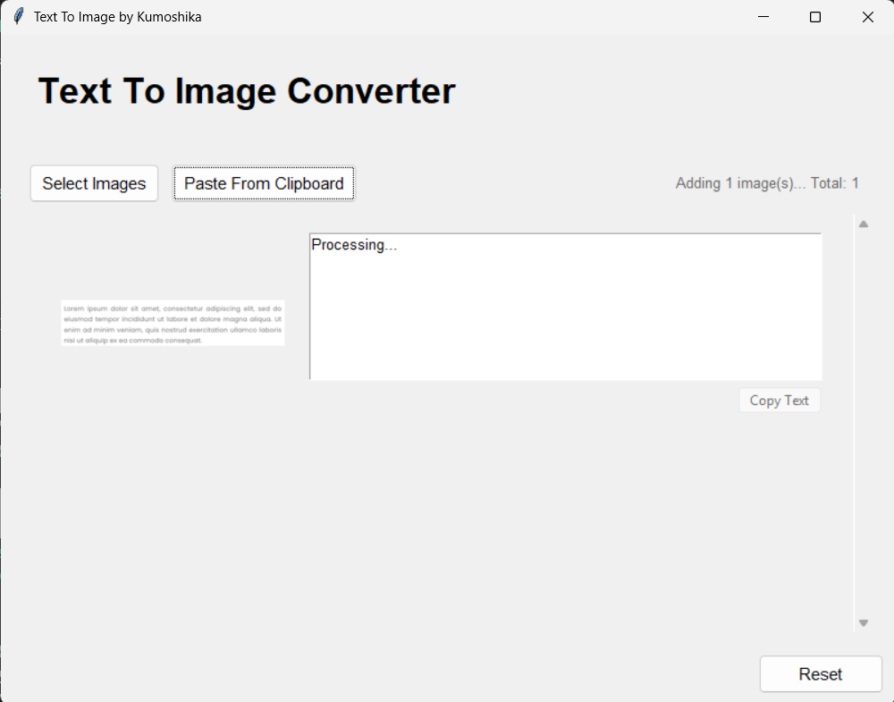
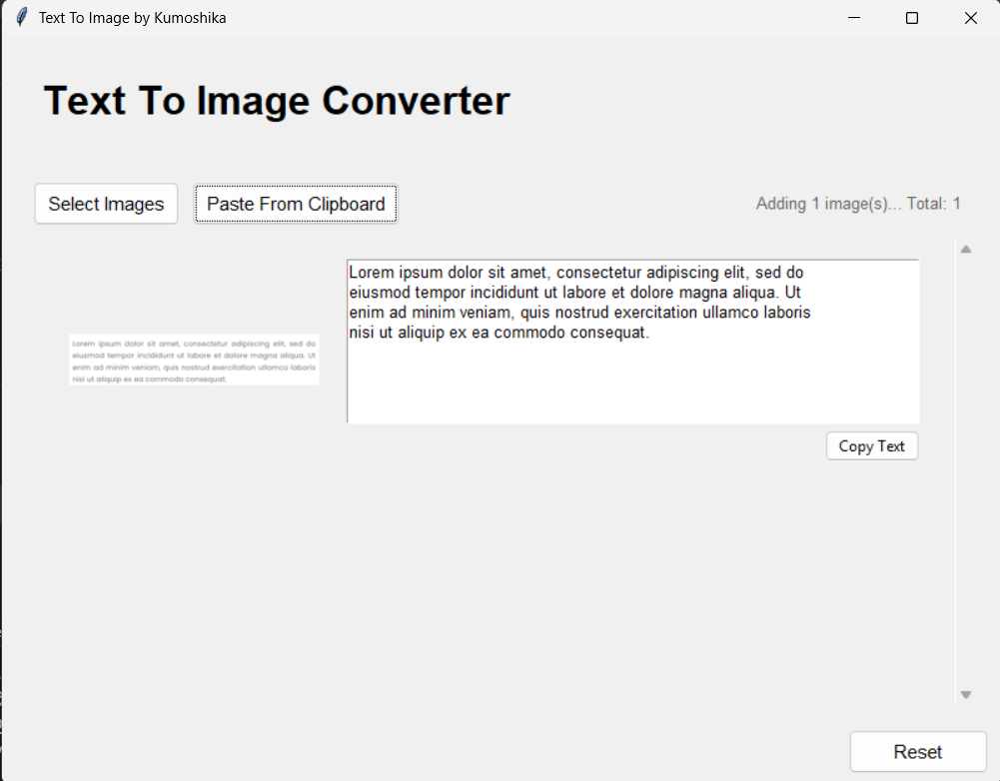

# KelingjiOCR
Simple OCR using Tkinter and PaddleOCR
Just a simple Python OCR, nothing special.  
Built this because I want to learn **Tkinter**.

---

## 📌 Features
- Simple and lightweight OCR tool.
- Built using **Python** and **Tkinter**.
- Supports image-based OCR using **PaddleOCR**.
- User-friendly interface with screenshot support.

---

## 🖼️ Screenshots

### Screenshot 1

### Screenshot 2

### Screenshot 3

---
